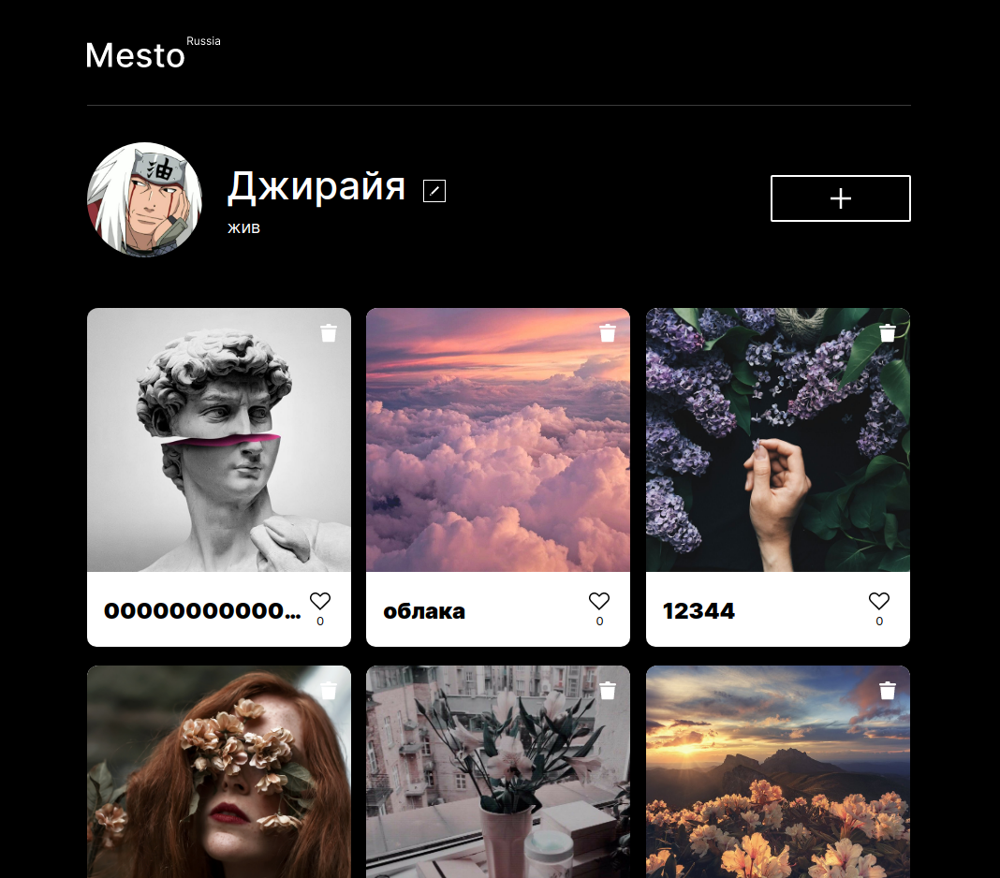

# Проект: Место

Данный проект является итоговой работой за 10-11-12 спринт на ***Яндекс.Практикуме***.

---
## *Описание*
----
<p align="center"></a></p>

### ***О чём проект?***

"Mesto" — это сайт, где люди обмениваются фотографиями.
"Местом" может быть что угодно: город, область или какое-то заведение.


Это учебный проект в [Яндекс.Практикуме](https://praktikum.yandex.ru/profile/web/). Проект создан для обучения и тренировки практических навыков адаптивной вёрстки и js.

---

### *Посмотреть проект на GitHub Pages: https://r0bomurlok.github.io/react-mesto-auth/*

### *Проект раелизован по макету из [Figma](https://www.figma.com/file/5H3gsn5lIGPwzBPby9jAOo/JavaScript.-Sprint-12?node-id=0%3A1)*

---

***В нём представлены:***

* Профиль пользователя и данные о нём;
* Фото-карточки с возможностью добавления и оценивания.

---
 ## *Функциональность:*
 * Редактирование профиля (имя и место работы);
 * Добавление своих фото-карточек;
 * Удаление своих фото-карточек;
 * Возможность поставить лайк понравившейся публикации;
 * Просмотр фотографии на полный экран;
 * Закрытие попапа по оверлею (фону) и по нажатию на Escape;
 * Реализована валидация всех форм;
 * Все данные хранятся на сервере, использовано сторонее API.
  ---
  ## *Используемые технологии:*

* Данный проект является *одностраничным* сайтом, написанный на языке разметки HTML5;
* Стили и картинки в самостоятельных папках и разбиты по блокам. Создана файловая структура по БЭМ (Nested);
* Для создания сеток используется  `flex` и `grid`;
* Реализованны переходы состояний ссылок и попапов (плавное затенение);
* Сайт адаптивен. Корректно отображается на самых популярных разрешениях экрана;
* Реализована валидация всех форм на сайте средствами JS;
* Код написан с помощью библиотеки `React`;
* Сборка проекта осуществлена с помощью `Webpack`;
* Реализована регистрация и вход в приложение;
* Реализован кастомный хук для валидации форм и универсального обработчика полей;
* Главная страница (/) защищена компонентом высшего порядка, без входа в приложение на неё не перейти;
* Использовано локальное хранилище браузера для сохранения токена, чтобы не входить заново при обнолении страницы;
* Реализовано бургерное меню в мобильной версии средстави React(Хуки);

---
## Запуск проекта:

Установить зависимости
```sh
npm i
```

Запустить проект на локальном сервере
```sh
npm run dev
```

---
## *Планы по доработке:*
  * Улучшить UX и UI.


<p>
    <a href="https://jigsaw.w3.org/css-validator/check/referer">
        
    </a>
</p>
